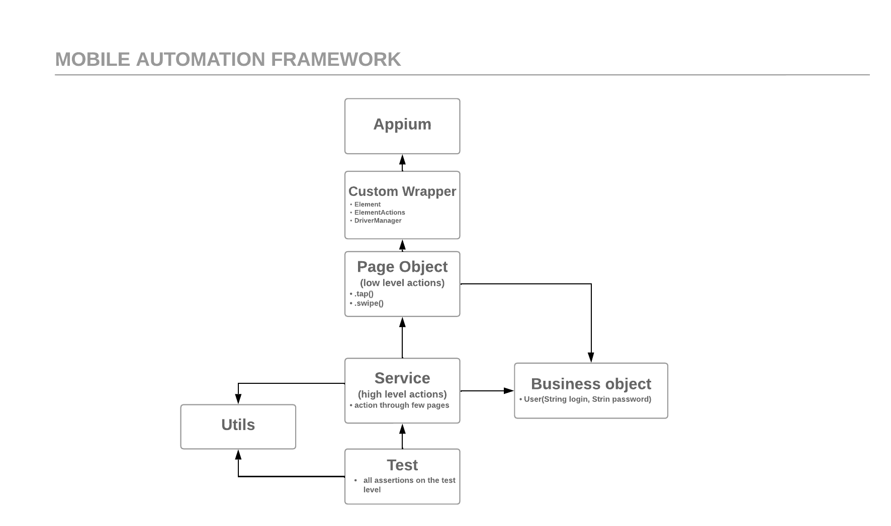

# 📱 Mobile Test Automation Framework

This is test automation framework built using **Appium**, **Java**, and **TestNG**. The framework is designed to facilitate automated testing of mobile applications on both Android and iOS platforms(IOS part is not implemented yet).

## 📊 Framework Architecture

Here is the link for the Test Automation Framework schema:


### ⚙️ Pre-Start Settings

Before running the tests, please ensure the following configurations are set up:

1. **Run tests**
    - Test suite for Android is located to `src/test/resources/testSuites/android/base_tests.xml`. Testng xml file contains two parameters:
    ```java
    <parameter name="platformName" value="Android"/>
    <parameter name="mobileDevice" value="Emulator"/>
      ```
    - To run the tests, ensure that the device is listed in `src/test/resources/testData/deviceData.json` (node of json with parameters). 
    - By default, the device `Emulator` with UDID `emulator-5554` is preconfigured. This means that if your emulator `emulator-5554` is running, the tests will pass.

### Application Under Test
   - The test application is located at `src/test/resources/testApp/android.wdio.native.app.v1.0.8.apk`.

### Framework description

1. **BaseMobileTest**
    - Initializes the test environment by terminating any previous Appium server processes to ensure a clean run of appium server for each session. It also initializes the `DriverManager`.
     ```java
        killNodeProcess();
      ```

2. **DriverManager Initialization**
    - The `DriverManager` is initialized with:
        - `platformName` (from `testng.xml`)
        - `testData` (name of JSON node) from `testData/deviceData.json` which contains:
            - `udid`
            - `appPath`

3. **Page Initialization**
    - In the `DemoAppTest` class, all pages used in tests are initialized. The `DriverManager` instance is passed to the constructors of each page. `BasePage` start to initialize Appium Driver:
      ```java
      this.driver = driverManager.getMobileDriver();
      this.driverManager = driverManager;
      this.actions = new ElementInteractions(driverManager);
      this.baseWaits = new BaseWaits(driverManager);
      ```

4. **Custom Element Class**
    - The custom element class defines locators for both Android and iOS platforms:
      ```java
      private static final Element HOME_PAGE = new Element(
          AppiumBy.accessibilityId("Home"),
          By.name("N/A"));
      ```
    - When using `driverManager.getMobileDriver()`, the appropriate driver is returned based on the `platformName` parameter specified in `testng.xml`.

5. **Element Interactions**
    - Pages utilize the `ElementInteractions` class for all action methods:
      ```java
      public void tapToHomePage() {
          actions.tap(HOME_PAGE);
      }
      ```

6. **Services Layer**
    - The services layer is not implemented yet but is designed to create entities that interact with multiple pages through a single method.

7. **Business Objects**
    - Services and page methods can utilize business objects, allowing for structured data management.
      ```java
      
      public void login(User user) {
        actions.setValue(EMAIL_INPUT, user.getUsername());
        actions.setValue(PASSWORD_INPUT, user.getPassword());
        actions.tap(LOGIN_BUTTON);
      }
      
      ```
      
8. **Assertions**
    - All assertions are handled at the test layer, ensuring clear separation between test logic and verification.

## 🚀 Getting Started

### Prerequisites

- Java 17
- Maven
- Appium
- TestNG
- Allure